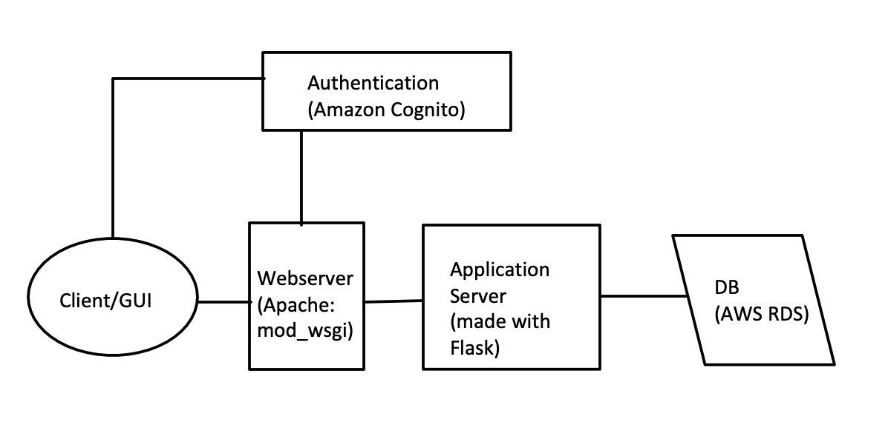

# moodtracker (WIP)
Moodtracker web app creation. 

A **mood tracker** is a tool that is used to keep a record of a person's mood at regular intervals in time.

This web app will allow a user to record their moods at different days and times and also show them their recorded moods for the year in a grid like format.

## First draft System Design

  
Details for first draft System Design

### Functional Requirements
- Users can log in to the web app
- Users can log out
- Users can view their mood board
- Users can add their mood for the day 
- Users can add at most two mood for each day
- Users cannot modify moods for previous days
- Mood will have 5 options
- Mood tracker will keep up to 1 year of data only (refreshes every year)
- Users will be emailed their final Mood board at the end of year

### Non-functional requirements
- System should be reliable
- System should be efficient (low latency)

### Capacity estimates 
*(I don't plan for that many users)*
#### Traffic estimates:
> 5 DAU * 1 mood board view ( fetching at most 12 months of mood data)= 5 requests per day
> 
> 5 DAU * 2 mood entries per day = 10 writes per day
> 
> 86400 seconds in a day
> 
> 5/86400 = 0.0001 requests per second
> 
> 10/86400=0.0001 writes per second
	
#### Bandwidth:
> 5  request per day * 1.5MB = 7.5 MB
>
> 86400 seconds in a day
> 
> 7.5 MB /86400 seconds=0.0001  MB per second
	
#### Storage:
> 10 writes per day * 1.5MB = 15 MB per day
> 
> 365 days in a year
> 
> 15 MB * 365 * 1 year = 5475 MB
	

### High level design

Web application will be deployed with Elastic Beanstalk service on AWS.

### Detailed design
#### Web server 
- Apache 
- Serves webpages to client
- Currently deploying mod_wsgi on my macOS which is an apache module (mod_wsgi is an Apache module which can host any Python WSGI application, including Flask.)
		
#### Application server
- Flask framework
- App server will handle read requests (mood board view) and write requests(entering mood for day) and interact with the DB
- App server will handle parsing and calculation of data to be shown or entered
		
		
### Database Model

	User table
		Id
		Username
		Email Address
		Names
		Password 
		
	Mood table
		UserId
		Mood for today
		
	CollectiveMood table (info that will be loaded up on mood board)
		UserId
		Mood for all past days in year

### Identifying and resolving bottlenecks and fault tolerance

- Sharding (horizontal partitioning) can be implemented for scalability
    - Multiple databases or tables for mood and users grouped by their last name value. 
    - e.g. User table 1 (A - M last names info), User table 2 (N - Z) last names info
			
- Multiple web servers and application servers with load balancing implemented
    - Some web servers have load balancers implemented, so load can be balanced by the web servers or by separte load balancers
	- Multiple web servers will be implemented to remove single point of failure
	- Different app servers can do different jobs instead of high latency being experienced when multiple users are using the app
	- The LB can balance the load based on Least connection or even Round robin since all the request should take the same amount of time
		
- Multiple Load balancers
	- There can be an active and passive LB and the passive can take over if the active is down
	- The load balancers would be in constant communication

